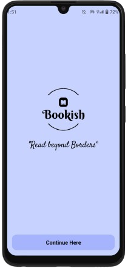

# Bookish App
Bookish Mobile App.

# Features
* Extensive Book Library
* Personalized Recommendations
* Reviews and Ratings
* Author Profiles

# Course Overview
* Basic React Native Components
* Database Design using Appwrite
* User Registration & Authenticaiton
* Deployment

# Tech Stack
* React Native
* AppWrite
* HTML, CSS and JS

# Home Screen
  

# Welcome Screen Screen
  

# Sign Up Screen
  

# One Time Pin (OTP) Screen
  

# Log In Screen
 

# Walkthrough

[Bookish App Walkthrough](https://youtu.be/TznlX26O4AE)